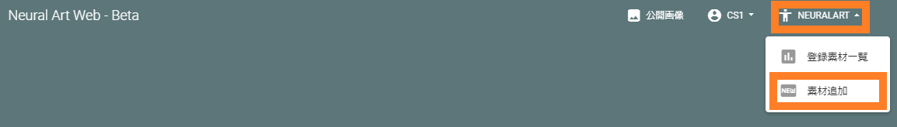

========================
素材登録(画風変換を行う)
========================

素材の準備ができたら、画風変換のための素材登録します。

素材登録フォーム
=================

ログインした状態で素材登録は以下より行えます。

それぞれの登録項目の設定の詳細は以下になります。

Material Name
--------------

これから登録する素材の名前です。お好きな名前も登録ください。

.. warning::
    日本語を入力するとエラーになる不具合が報告されています。

Style Image
------------

スタイル画像を選択します。一般的には、名画や写真などを指定します。

スタイルセマンティックマップ利用設定
-------------------------------------

スタイルセマンティックマップの利用有無を選択します。

    * スタイルセマンティックマップを指定する
        - [Style Segmap]でスタイルセマンティックマップ指定したものが画風変換に利用されます。
    * 単純背景(白)
    * 単純背景(黒)
    * 単純背景(青)
    * 単純背景(赤)
    * 単純背景(緑)
        - 単純背景では、スタイルセマンティックマップが一色のものが自動生成されます。コンテンツセマンティックマップの何色の部分にスタイルを適用したいかに応じて適切な色を選択してください。

Style segmap
-------------

スタイルセマンティックマップを選択します。[スタイルセマンティックマップ利用設定]で[スタイルセマンティックマップを指定する]にした場合有効となります。

Content image
--------------

コンテンツ画像を選択します。ここでは、文字を含んだロゴやポスターを想定しています。文字を含んでいなくても画風変換は適切に行われます。

Use content segmap
-------------------

|  コンテンツセマンティックマップの利用有無を指定します。チェックが入っていれば利用することになり、[Content segmap]でコンテンツセマンティックマップを指定します。
|
|  チェックがない場合は、コンテンツセマンティックマップはコンテンツ画像と同一になります。例えば、コンテンツ画像の背景が白であり、その部分にスタイルを適用したい場合はチェックを外してください。このとき、スタイルセマンティックマップで単純背景(白)を選択するか、任意のスタイルセマンティックマップに白色の部分がなければなりません。

Content segmap
---------------

コンテンツセマンティックマップを選択します。[Use content segmap]にチェックが入っている場合のみ有効となります。

Start at
---------

画風変換の実施開始時刻を選択(予約)します。ページを表示した瞬間に直近で空いている時間が初期値となります。

.. note::
    * 1時間ごとに指定ができます。
    * 最短で3時間後から指定ができます。

素材登録に関する注意
=====================

一度登録した素材は変更できません。登録の変更の必要がある場合は、削除して再度登録してください。
