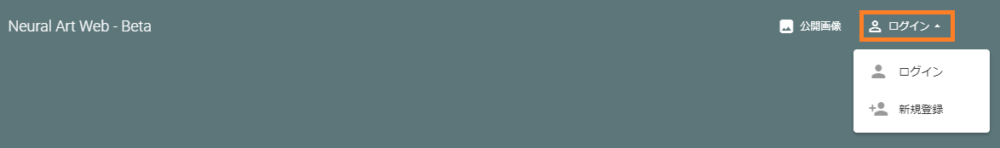
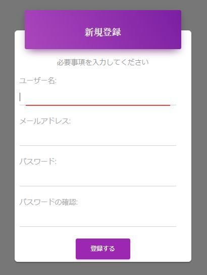
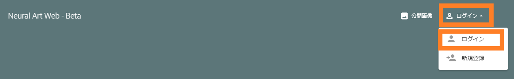
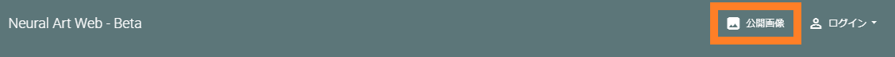

=========================
Neural Art Webの使い方
=========================

このWebアプリは、PC, スマートフォン両方のデバイスからご利用いただけます。
このManualではPCでの画面を紹介しております。スマートフォンでは、表示方法が変わる場合がございますので、予めご了承ください。

ユーザを作成する
=================

まずは、ユーザ登録を行います。
右上のメニューより、[ログイン]を選択し、[新規登録]を選択します。

フォームに必要事項を入力すると、ユーザが登録できます。
ログインの際は、 **ユーザ名** と **パスワード** が必要となります。

以上で、ユーザ登録は完了です。

.. note::
    現在は、ユーザ登録確認メールなどの実装はしておりません。

ログインする
=============

ユーザ登録が完了すると、自動でログインされますがログアウトした場合のログインは、以下より行えます。

.. note::
    ログインには、ユーザ名とパスワードが必要です。(メールアドレスではありません。)

とりあえず生成画像を見てみる
=============================

ユーザによって共有されている生成画像を見ることができます。

.. note::
    * 公開画像はログインしなくて閲覧することができます。
    * 表示される結果は、公開が許可されている画像のうち、ランダムに最大100件です。

