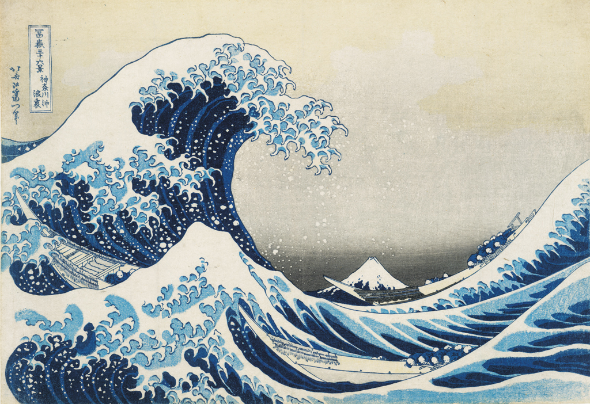
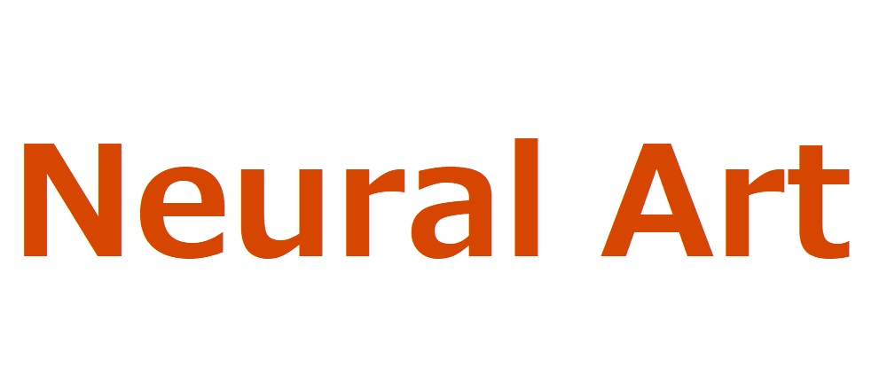

=================
素材を準備する
=================

このWebアプリでは、画風変換 [#f1]_ を行えます。
画風変換には、スタイル画像とコンテンツ画像の2種類が必要です。さらに、このWebアプリではセマンティックマップを利用することで、ロゴやポスターなどの複雑な画像に対しても画風変換が行えるようになっております。

スタイル画像・スタイルセマンティックマップ
===========================================

画風変換では「名画風」「ある風景写真風」というように、画像の雰囲気を変換します。その雰囲気の役割を果たすのが、「スタイル画像」です。例えば以下のような、スタイル画像があるとします。

任意のロゴなどを上の画像風に変換することを画風変換といいます。そして、上の画像のことを「スタイル画像」と呼びます。
しかし、よく見てみると上の画像の大きな特徴は「波」があることではないでしょうか。そこで、その部分を特に強調したい場合にセマンティックマップを利用します。

上の画像は、スタイル画像の特徴したい部分を強調したものなので、「スタイルセマンティックマップ」と呼びます。
スタイルセマンティックマップの白い部分に注目してください。白い部分は、スタイル画像の波の部分と一致することがわかると思います。

.. note::
    スタイル画像とスタイルセマンティックマップのサイズは同一でなければなりません。

コンテンツ画像・コンテンツセマンティックマップ
================================================

スタイル画像をどの画像に適用するかは重要です。例えば、以下のロゴを前述したスタイル画像を用いて画風変換したいとします。

上の画像の白い部分(オレンジの文字以外の部分)がスタイル画像風になれば、良い結果となりそうです。
そこで、その場所を指定するのがスタイルセマンティックマップです。以下のようになります。

ここで、スタイル画像とスタイルセマンティックマップが同一のことに気付かれると思います。
これは、スタイル画像の文字以外の部分が白背景のためです。
つまり、 **スタイルセマンティックマップの白色の部分** が、 **コンテンツセマンティックマップ白色の部分** と対応付くため、このようなことになります。 **もし、スタイルセマンティックマップの波の部分が黒色であれば、コンテンツセマンティックマップの背景の部分も黒色** にしないといけません。

.. note::
    コンテンツ画像とスタイルセマンティックマップのサイズは同一でないといけません。

.. rubric:: 脚注

.. [#f1] 利用技術 Deep Photo Style Transfer: https://arxiv.org/abs/1703.07511
