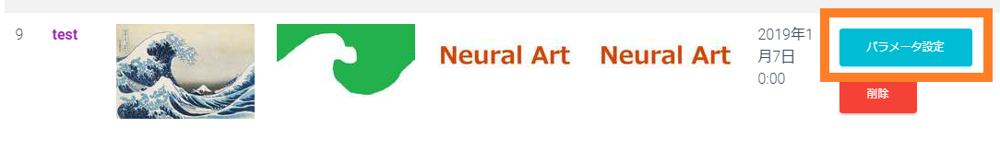

================
パラメータ設定
================

素材を追加することにより、画風変換は可能になりますが、パラメータ設定をすることにより結果に変化を持たせることができます。
まずは、登録素材一覧のページを表示します。登録素材ごとに、パラメータ設定が行えます

.. note::
    * この作業は、生成開始時間までに余裕をもって(約15分前)行ってください。一度生成が開始されると、パラメータ設定の変更は適用されません。

パラメータ設定フォーム
=======================

以下がそれぞれの項目に関する説明です。

コンテンツ画像の強さ
---------------------

コンテンツ画像が生成結果に対してどれほど強くなるか設定します。

スタイル画像の強さ
-------------------

スタイル画像が生成結果に対してどれほど強くなるか設定します。

学習回数
----------

学習回数を設定します。一般的には1000回で十分ですが、4000回まで設定できます。

.. note::
    * 生成画像は100回ごとに保存されます。3000回であれば、30枚の画像ができます。
